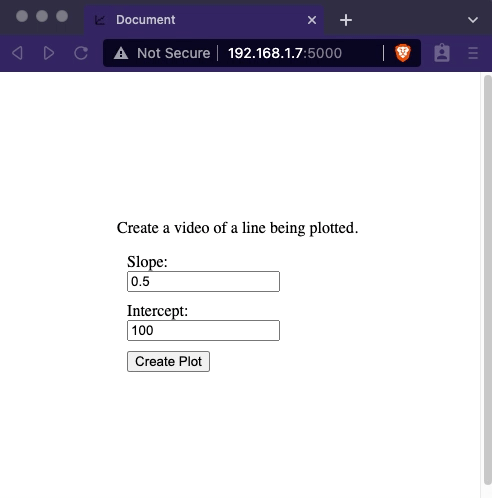

# Video Generator

Web app generating a video of a line being plotted via matplotlib

## Author

[Albert Patterson](mailto:albert.patterson.code@gmail.com)

- [Linkedin](https://www.linkedin.com/in/apattersoncmu/)
- [Github](https://github.com/albertpatterson)
- [npm](https://www.npmjs.com/~apatterson189)
- [Youtube](https://www.youtube.com/channel/UCrECEffgWKBMCvn5tar9bYw)
- [Medium](https://medium.com/@albert.patterson.code)

## Installation

- Clone this repository
- `pip install -r requirements.txt`
- install ffmpeg. On mac it can be installed in the same repository and the path specified in create_plot.py. On Windows and Linux, install the compatible executable, add it to the path and remove the path specified in create_plot.py
- `python app.py`
- The address that the service is running on will be printed to the terminal

## Setup on a Raspberry Pi

- Clone this repository
- remove the provided ffmpeg executable
- remove the ffmpeg path specification in create_plot.py
- install ffmpeg via apt-get
- `python app.py`
- note that in app.py the param `host='0.0.0.0'` is important in order to create an [Externally Visible Server](https://flask.palletsprojects.com/en/2.0.x/quickstart#public-server)
- If the server needs to be accessed outside of the local network, forward the port via the router
